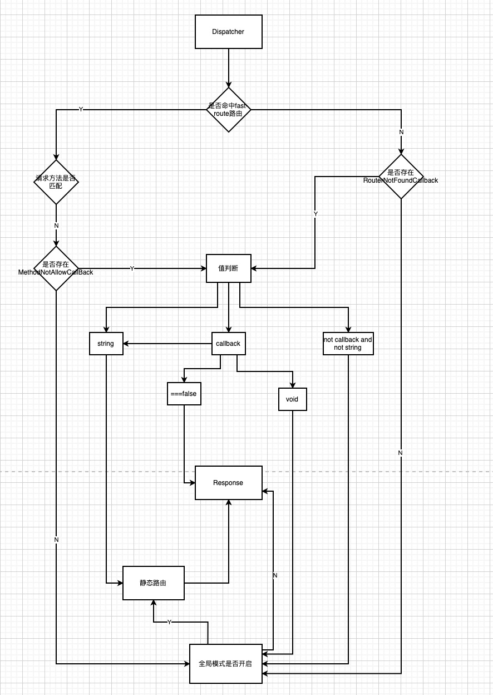

# EasySwoole HTTP 服务组件

一个轻量级的HTTP Dispatch组件
## Server Script
```php
namespace App\HttpController;
use EasySwoole\Http\AbstractInterface\Controller;
use EasySwoole\Http\Dispatcher;
use EasySwoole\Http\Request;
use EasySwoole\Http\Response;
use Swoole\Http\Server;

require_once 'vendor/autoload.php';


class Index extends Controller
{

    function index()
    {
        // TODO: Implement index() method
        $this->response()->write('hello world');
    }
}


$dispatcher = new Dispatcher();
$dispatcher->setNamespacePrefix('App\HttpController');
$http = new Server("127.0.0.1", 9501);

$http->on("request", function ($request, $response) use($dispatcher){
    $request_psr = new Request($request);
    $response_psr = new Response($response);
    $dispatcher->dispatch($request_psr, $response_psr);
    $response_psr->__response();
});

$http->start();
```

## 全局参数Hook
```
namespace App\HttpController;
use EasySwoole\Http\AbstractInterface\Controller;
use EasySwoole\Http\Dispatcher;
use EasySwoole\Http\GlobalParam\Hook;
use EasySwoole\Http\Request;
use EasySwoole\Http\Response;
use EasySwoole\Session\FileSession;
use EasySwoole\Session\Session;
use Swoole\Http\Server;

require_once 'vendor/autoload.php';


class Index extends Controller
{

    function index()
    {
        $this->response()->write('hello world');
    }

    function get()
    {
        var_dump($_GET['a']);
    }

    function session()
    {
        if(isset($_SESSION['isNew'])){
            $this->response()->write('your are old user');
        }else{
            $_SESSION['isNew'] = 1;
            $this->response()->write('your are new user');
        }
    }

    function session2()
    {
        $this->writeJson(200,$_SESSION->toArray());
    }
}


$dispatcher = new Dispatcher();
$dispatcher->setNamespacePrefix('App\HttpController');
$http = new Server("127.0.0.1", 9501);
$hook = new Hook();
$session = new Session(new FileSession(__DIR__.'/session'));
$hook->enableSession($session);
$hook->register();
$http->on("request", function ($request, $response) use($dispatcher,$hook){
    $request_psr = new Request($request);
    $response_psr = new Response($response);
    $hook->onRequest($request_psr,$response_psr);
    $dispatcher->dispatch($request_psr, $response_psr);
    $response_psr->__response();
});

$http->start();
```

### 说明
- 如果没有```enableSession```，那么```$_SESSION```则不可用。
- ```$_SESSION```目前仅支持如下操作：
    - isset
    - $_SESSION['name'] = value
    - unset($_SESSION['name']);
    - $_SESSION->toArray() 
    _ $_SESSION->loadArray();

## 动态路由匹配规则

